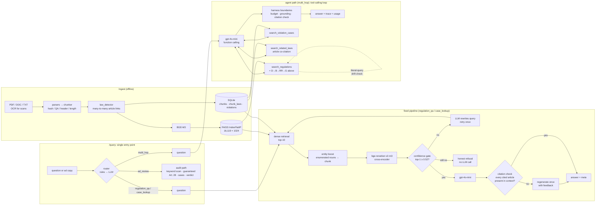

# food-rag: Retrieval-Augmented QA over Taiwanese Food Regulations

[](https://github.com/natalie930302/food-rag/actions/workflows/ci.yml)
[](LICENSE)
[中文 README](README.md) · [Research log (zh)](docs/RESEARCH_LOG.md) · [Full results](eval/RESULTS.md) · [Technical report](docs/technical_report.md)

A question-answering API over 16,119 chunks of Taiwan FDA regulations / guidelines / official Q&A and 400
Taipei City advertising-violation penalty notices. **Local BGE-M3 embeddings + FAISS → cross-encoder reranking →
confidence gate → cloud LLM**, plus a bounded tool-calling agent (used only when `/query` classifies a question as
multi-hop). The point is not the feature list:
**every component has quantitative evidence, every "improvement" carries a confidence interval, and negative results
are reported as they happened.**

## 30-second summary

| Question | Answer | Evidence |
|---|---|---|
| Does two-stage retrieval (dense → rerank) help? | **Depends on the reranker.** `bge-reranker-base` gives no significant gain (p = 1.00); `bge-reranker-v2-m3` does (Recall@1 +0.11 [+0.04, +0.19], p = 0.008) | [§1](#1-retrieval-two-stage-is-not-automatically-better) |
| Does the system refuse when retrieval is unreliable? | Yes. At threshold 0.52, 20/20 out-of-domain questions are refused; the cost is 8/108 in-domain false refusals | [§2](#2-confidence-gate-the-clean-threshold-was-a-small-sample-artefact) |
| Is "let the LLM decide" better than a fixed retry? | **No.** Single-hop 99 vs 99/108; even on the 20 multi-hop questions built for it, 6 vs 10 (p = 0.22). Its only win is the related-articles tool the baseline lacks (3/3) | [§3](#3-agent-fixed-retry-vs-tool-calling-harness), [§5](#5-multi-hop-when-the-agent-actually-matters) |
| What does each harness boundary actually block? | Ablation says: only the drift check (30 → 27/32 when off); the forced refusal and the citation check caught nothing on this set — insurance, not gain | [§4](#4-harness-ablation-why-each-boundary-exists) |
| Does RAG actually beat the closed-book LLM? | **Yes — measured on external questions for the first time**: 260 national dietitian-exam questions, closed-book 66.9 % → RAG + fallback 80.0 % (+0.13 [+0.09, +0.17], p < 0.001); regulation questions 62.3 % → 83.6 % | [§6](#6-national-exam-the-only-eval-set-we-did-not-write-ourselves) |
| When should the agent be used at all? | `/query` routes first: rule layer 100 %, overall 97.6 %, only multi-hop goes to the agent, 0 harmful misroutes | [§7](#7-router-a-new-failure-point-measured) |
| Is the eval set big enough? | 24 hand-written → **108** (+84 LLM-generated, human-reviewed), plus 8 hard, 20 out-of-domain, 20 multi-hop, **260 national-exam MCQs with official answers** | [eval/](eval/) |

## Architecture



The fixed pipeline is deterministic (low confidence → exactly one rewrite-and-retry). The agent path wraps the same
retrieval as tools and lets the LLM drive control flow. All three paths share one harness layer (`app/harness.py`) —
the same trace, usage, refusal contract and citation check — with boundaries enforced in code: **a prompt is a request,
code is a guarantee.**

`/query` is the single entry point: zero-cost keyword rules classify the intent first, and only when they cannot decide is
gpt-4o-mini asked once (structured JSON, temperature 0). **Only questions that genuinely need multi-step retrieval go to the
agent** — on single-hop questions the agent is as accurate as the fixed pipeline but twice as slow (§3), so the cheap,
deterministic path is the default (the Adaptive-RAG idea). The routing decision and its reason are returned in `route`.

## Results

Everything is reproducible with `make eval`; full tables and per-question records are in [eval/RESULTS.md](eval/RESULTS.md).
Intervals are 95 % percentile-bootstrap CIs (10,000 resamples); differences between configurations use paired bootstrap
plus an exact sign test.

### 1. Retrieval: two-stage is not automatically better

108 questions (24 hand-written + 84 synthetic), candidate pool fixed to dense top-10, only the ordering changes:

| Configuration | Recall@1 | Recall@3 | MRR |
|---|---|---|---|
| BGE-M3 dense only | 0.722 [0.639, 0.806] | 0.861 [0.796, 0.926] | 0.800 [0.736, 0.862] |
| + bge-reranker-base | 0.731 [0.648, 0.815] | 0.935 [0.889, 0.972] | 0.826 [0.767, 0.883] |
| **+ bge-reranker-v2-m3** | **0.833 [0.759, 0.898]** | 0.907 [0.852, 0.954] | **0.874 [0.818, 0.926]** |

| Comparison (Recall@1) | Δ [95 % CI] | flipped right / wrong | sign test p |
|---|---|---|---|
| dense → +base | +0.009 [−0.065, +0.083] | 9 / 8 | 1.000 |
| +base → +v2-m3 | **+0.102 [+0.037, +0.176]** | 13 / 2 | **0.007** |
| dense → +v2-m3 | **+0.111 [+0.037, +0.185]** | 15 / 3 | **0.008** |

**This overturns an earlier conclusion.** With 24 questions, `bge-reranker-base` moved Recall@1 from 0.708 to 0.750 and
was written up as a clear win — it was one extra correct question. On 108 questions it flips 9 right and 8 wrong,
i.e. nothing. The real gain came from switching to a stronger reranker, a decision that was originally traced from a
single failure case (a lexical confusion between "classified storage" and "how is it classified"); see the
research log. Hand-written (n = 24) and synthetic (n = 84) subsets agree in direction; the synthetic questions are
*harder*, not easier (Recall@1 0.810 vs 0.917).

### 2. Confidence gate: the "clean threshold" was a small-sample artefact

A simplified Corrective RAG (Yan et al., 2024): the reranker's top-1 score acts as the relevance evaluator; below
the threshold the system refuses and never calls the LLM. The threshold was calibrated on 24 in-domain + 6
out-of-domain questions, where the two score distributions had a clean gap (+0.93); the midpoint was 0.52.

On 108 + 20 questions **the gap is gone** (−0.33):

| Threshold | in-domain false refusals | out-of-domain leaks |
|---|---|---|
| 0.52 (current) | 8 / 108 (7.4 %) | 0 / 20 |
| 0.068 (min. total error) | 0 / 108 | 2 / 20 |

No threshold achieves zero on both. Four of the eight refused questions have their answer inside a table row (pesticide
residue limits, inspection fees), which the reranker scores low regardless. Keeping 0.52 is a deliberate
"refuse rather than bluff" product decision, not a statistical optimum — both costs are on the table.

End-to-end (`eval/eval_corrective.py`, threshold 0.52): in-domain confident-and-correct **96/108 = 0.889 [0.824, 0.944]**
(hand-written 24/24, synthetic 72/84); 8 false refusals; and **4 confidently-wrong** cases — high score, wrong
chunk — the structural blind spot of any confidence-based gate. Out-of-domain: **20/20** refused, including the four
near-domain traps (cosmetics labelling 0.24 and lease notarisation 0.40 came closest to the threshold).

### 3. Agent: fixed retry vs. tool-calling harness

Same questions, same hit definition (is the gold chunk among the chunks finally used to answer):

| Set | Fixed retry (fixed pipeline) | Tool-calling agent (agent path) | flipped right / wrong | sign test p |
|---|---|---|---|---|
| main (108) | 99/108 = 0.917 [0.861, 0.963] | 99/108 = 0.917 [0.861, 0.963] | 1 / 1 | 1.000 |
| hard (8) | 7/8 = 0.875 [0.625, 1.000] | 6/8 = 0.750 [0.375, 1.000] | 0 / 1 | 1.000 |

- **The fixed rewrite-and-retry does help at n = 108**: 8 retries triggered, 3 rescued. The earlier negative result
  ("1 triggered, 0 rescued" on the 8-question hard set) was a sample-size artefact.
- **The agent ties on single-hop questions; it is not better.** Only 3 of 108 questions used more than one tool call;
  the literal-anchor drift check intervened on 24; latency is 18.6 s/question (reranker on GPU; the fixed pipeline ~11 s).
  The earlier "31/32 beats 30/32" conclusion does not survive n = 108 (99 vs 99).
- Both systems have **confidently-wrong** cases (fixed retry: 6 + 1) that no confidence mechanism can detect.
- Conclusion: the agent's extra freedom (choosing its own query strings and how many calls to make) buys latency, not
  accuracy, on single-hop questions. Its value can only be measured on multi-hop questions (§5) — and there it does not
  win either; only the related-articles tool is uniquely its own. That is why `/query` routes only multi-hop questions
  to the agent and everything else to the fixed pipeline (§7).

### 4. Harness ablation: why each boundary exists

Each agent-path boundary switched off one at a time, same questions (24 hand-written + 8 hard for hit rate; 20
out-of-domain for "answered without evidence"):

| Config | What is off | in-domain hit | OOD answered w/o evidence | s/question |
|---|---|---|---|---|
| full | — | **30/32 = 0.938 [0.844, 1.000]** | 0/20 | 18.6 |
| no_grounding | no forced refusal when ungrounded | 31/32 = 0.969 [0.906, 1.000] | **0/20** | 18.9 |
| no_drift_check | no literal-query consistency anchor | **27/32 = 0.844 [0.719, 0.969]** | 0/20 | 10.8 |
| temp_0.1 | decision temperature back to 0.1 | 30/32 = 0.938 [0.844, 1.000] | 0/20 | 19.8 |

Three honest conclusions — one positive, one "redundant", one "not measurable in a single run":

- **The drift check earns its keep**: switching it off loses 3 questions (30 → 27), exactly the query-drift cases
  diagnosed earlier; the cost is ~7 s per question for the second rerank.
- **The forced-refusal override was redundant on this set**: with it off, gpt-4o-mini refused all 20 OOD questions on its
  own, in its own words (the first script version compared the literal refusal string and miscounted 19/20 as bluffs;
  a semantic check gives 0/20). Its value is a *guarantee*, not a measured gain — the prompt held this time, which says
  nothing about the next model or the next prompt, so it stays, labelled honestly as having caught nothing here.
- **temperature = 0 cannot be shown in one run**: 0.1 also scores 30/32. The earlier "same question, different result on
  rerun" flakiness is a variance effect that needs repeated runs; a single ablation cannot see it.

**The answer-level citation check is the same kind of result** (`eval/eval_citation_verifier.py`): 100 of 108 questions
passed the gate and got an answer, 88 answers cite article numbers, and **0/100** cited an article absent from the
context before any regeneration — the regenerate-with-feedback path never fired. The prompt's "do not invent article
numbers" held on gpt-4o-mini. So of the four boundaries, **only the drift check has a measurable effect on this eval
set**; the forced refusal and the citation check are code-level insurance that the current model + prompt never needed,
but that is exactly what catches the regression when either changes. This is more honest than "all four boundaries
matter", and more useful: it says what the harness's cost (an extra rerank and an extra check per question) buys.

### 5. Multi-hop: when the agent actually matters

Single-hop questions cannot show the agent's value (§3), so 20 hand-written questions require "regulation + case" or
"regulation + related article" (`eval/multihop_questions.json`). The hit is split into three components; all required
components must be met for a full hit:

| Component | baseline (fixed pipeline: fixed retry + keyword-triggered case lookup) | tool-calling agent |
|---|---|---|
| reg_hit (right regulation) | **13/20 = 0.650 [0.450, 0.850]** | 8/20 = 0.400 [0.200, 0.600] |
| case_hit (right case; required by 17) | 16/17 = 0.941 [0.824, 1.000] | 15/17 = 0.882 [0.706, 1.000] |
| related_hit (related articles; required by 3) | 0/3 (no such tool) | **3/3** |
| **full_hit** | **10/20 = 0.500 [0.300, 0.700]** | 6/20 = 0.300 [0.100, 0.500] |

Flipped 1 right / 5 wrong, sign test p = 0.219; the agent averaged 2.25 tool calls and used more than one on 19/20
questions — the harness was genuinely exercised this time.

**Honest conclusion: even on the questions designed for it, the agent does not beat "fixed pipeline + keyword rules".**
Breaking it down explains why:

- For the case hop, the fixed pipeline's keyword trigger (query cases if the question mentions penalties / cases) does as well as the
  LLM deciding to (16 vs 15).
- For the regulation hop the agent loses 5 questions: the LLM's condensed queries drift more in multi-step settings
  (§3's query drift amplified), and on 2 questions it skipped `search_regulations` entirely and only queried cases, so
  the harness correctly refused as ungrounded.
- The agent's only irreplaceable capability is `search_related_laws` (3/3): the baseline simply cannot do it.

The first run of this set scored 0/17 on cases; tracing it revealed that `search_violation_cases` was searching the
regulation-chunk FAISS index instead of the case index — a real bug that had been hiding for months and that only a
multi-hop set could expose. Fixed, with a regression test.

The next step is clear, and it is not "make the agent smarter": build the case and related-law lookups as a
**rule-triggered deterministic multi-step pipeline** and compare again. If it ties, the agent's remaining value in this
domain is exploring unknown tool combinations; if the agent wins, that is the evidence it needs to exist.

### 6. National exam: the only eval set we did not write ourselves

Every set above shares a weakness: the questions were written by us or generated by an LLM, and the metric is
"was the gold chunk retrieved". This set is different: **260 multiple-choice questions from the Taiwanese national
dietitian licensing exam ("Food Hygiene and Safety", 2020–2025) with the official answer key** — fetched and parsed from
the Ministry of Examination's public archive by `scripts/build_exam_set.py` (exam questions are exempt from copyright
under Article 9 of the Copyright Act). It measures **whether the final answer is right**. Three systems on the same
questions; a refusal counts as wrong; "regulation" is a reproducible keyword heuristic, not hand-picking:

| Group | n | Closed-book gpt-4o-mini | RAG (refuse when unconfident) | **RAG + closed-book fallback** | RAG answered / precision | Δ (fallback − closed) [95 % CI] | flipped right / wrong | p |
|---|---|---|---|---|---|---|---|---|
| all | 260 | 0.669 [0.612, 0.727] | 0.369 [0.312, 0.427] | **0.800 [0.750, 0.846]** | 112 / 0.857 | **+0.131 [+0.088, +0.173]** | 36 / 2 | <0.001 |
| regulation | 122 | 0.623 [0.533, 0.705] | 0.582 [0.492, 0.664] | **0.836 [0.770, 0.902]** | 82 / 0.866 | **+0.213 [+0.131, +0.295]** | 28 / 2 | <0.001 |
| other (microbiology / toxicology / processing) | 138 | 0.710 [0.630, 0.783] | 0.181 [0.116, 0.246] | 0.768 [0.696, 0.833] | 30 / 0.833 | +0.058 [+0.022, +0.101] | 8 / 0 | 0.008 |

(random guessing = 0.25; 380 LLM calls, 247k tokens, ≈ US$0.04)

This is the **only place in the project where RAG beats the closed-book LLM significantly and by a wide margin**, and
it does so exactly where it should: regulation questions go from 62 % closed-book to 84 % with retrieval (28 flipped
right, 2 wrong); non-regulation questions gain only 6 %, because the corpus contains no microbiology. The confidence gate
behaves as intended too: RAG answers only 112 of 260 and is 86 % correct when it does; the rest fall back to closed-book —
"answer with evidence, refuse without" holds on external questions. Two honest footnotes: 16 % of regulation questions
are still wrong (both systems miss, mostly fine-grained numbers the corpus does not cover), and the "regulation" split is a
heuristic that includes a few non-regulation items and misses a few regulation ones — but it is reproducible, unlike
hand-picking.

### 7. Router: a new failure point, measured

The `/query` router is a new place to be wrong, so it is evaluated on its own (`eval/eval_router.py`). The labels come
for free: 108 + 8 single-hop questions → `regulation_qa`, 20 multi-hop → `multi_hop`, plus 30 hand-written ad-review /
case-lookup / edge cases — 166 in total.

| | n | accuracy |
|---|---|---|
| rule layer (free, deterministic) | 61 (37 %) | 61/61 = 1.000 |
| LLM layer (asked only when rules abstain) | 105 (63 %) | 101/105 = 0.962 |
| **overall** | 166 | **162/166 = 0.976 [0.952, 0.994]** |

| gold \ pred | regulation_qa | case_lookup | ad_review | multi_hop | recall |
|---|---|---|---|---|---|
| regulation_qa | 120 | 1 | 1 | 1 | 0.976 |
| case_lookup | 0 | 7 | 0 | 1 | 0.875 |
| ad_review | 0 | 0 | 10 | 0 | 1.000 |
| multi_hop | 0 | 0 | 0 | 25 | 1.000 |

The two error directions have asymmetric costs and are counted separately: **harmful** (multi_hop routed to a single-hop
path, which silently drops cases / related articles) — **0**; wasteful (single-hop routed to the agent, merely slower) — 2.
The first version of the rule layer scored only 90 %: generic penalty words ("罰款", "裁罰") were treated as case signals,
so "how is the penalty schedule set?" was routed to case lookup. Narrowing the rules to fire only on strong signals and
handing everything else to the LLM took the rule layer to 100 % and the total from 94.0 % to 97.6 % — a concrete case of
"keep rules narrow; use the LLM as the fallback, not the workhorse".

## Honest limitations

- **Synthetic-question bias.** 84 questions were written by gpt-4o-mini while looking at the chunk. Lexical overlap
  is filtered (longest common substring ≤ 6 characters) and 56 candidates were rejected by hand (non-unique gold,
  table fragments, OCR noise), but they are still not real user queries.
- **Confidently-wrong is undetectable.** The gate scores "does this look relevant", not "is the answer right"; the
  citation check only catches article numbers absent from the context, not a correct article misread.
- **Skewed case corpus.** 391 of 400 penalty notices cite Article 28 of the Food Safety Act, so case-hit on the
  multi-hop set is easy for any system that actually queries cases.
- **Article detection is Arabic-numeral only.** "第十五條" is not linked; `第15條之一` used to be parsed as
  `第15條` (fixed 2026-09, index not yet rebuilt).
- **Non-determinism.** Agent decision temperature is 0, but the OpenAI API does not guarantee reproducibility.

## Quick start

```bash
# system deps (Ubuntu/WSL2): tesseract-ocr tesseract-ocr-chi-tra libreoffice poppler-utils
make install && source .venv/bin/activate
cp .env.example .env            # set OPENAI_API_KEY
make unzip && make ingest       # first run downloads BGE-M3 (~2.3 GB)
make run                        # http://localhost:8000/docs
```

There are only two feature endpoints — **every question, ad audit and multi-hop query goes through `/query`**; `/health`
reports system status:

```bash
curl -X POST localhost:8000/query -H "Content-Type: application/json" -d '{"question": "真空包裝豆干要符合什麼規定?"}'
curl -X POST localhost:8000/query -H "Content-Type: application/json" -d '{"question": "本產品有效改善高血壓", "force_intent": "ad_review"}'
curl localhost:8000/health
```

Whichever path is taken, the response has one shape (`app/harness.py`):

| Field | Content |
|---|---|
| `route` | detected intent, whether rules or the LLM decided, reason, the handler actually used (regulation / review / agent) |
| `trace` | every step — `retrieve` / `retry` / `retrieve_cases` / `generate` / `verify_citations` / `refuse`, the audit's `keyword_scan` / `verdict`, the agent's `tool:search_regulations` … — with timing, confidence, chunk ids, drift intervention |
| `usage` | LLM calls, tool calls, prompt / completion tokens, seconds, stop reason (answered / tool_calls / tokens / seconds) |
| `meta` | `confident`, `used_retry`, `refused` (the refusal contract), `unsupported_citations` (citation check), `grounded`, `hit_tool_call_limit` |
| `verdict` | audit only: low / medium / high — the LLM report's conclusion decides, keyword rules act as a floor |

`/laws/{article}/related` and `/files/{path}` are data endpoints for the UI, not features.

```bash
make test     # 84 unit tests; no models or API key needed
make lint
make eval     # rerun all evaluations → eval/RESULTS.md (needs index + API key)
python scripts/replay_trace.py eval/results_tool_agent_drift_check.json --miss   # step-by-step replay of misses
```

## Layout

```
app/        main.py (/query + /health only), router.py (rules → LLM), handlers.py (three execution paths sharing one
            RunContext), harness.py (unified trace / usage / refusal contract / citation check), retrieval,
            corrective_retrieval, agentic_retrieval, agent + agent_tools (tool-calling loop), verifier
ingest/     parsers (PDF/DOCX/OCR/tables) → chunker (4-strategy router) → law_detector → SQLite + FAISS
eval/       question sets, scripts, stats.py (bootstrap / sign test), RESULTS.md
tests/      unit tests with a fake reranker and a scripted LLM client
docs/       research log, technical report
scripts/    replay_trace, extract_chunk_entities, inspect_index
```

## License

MIT
