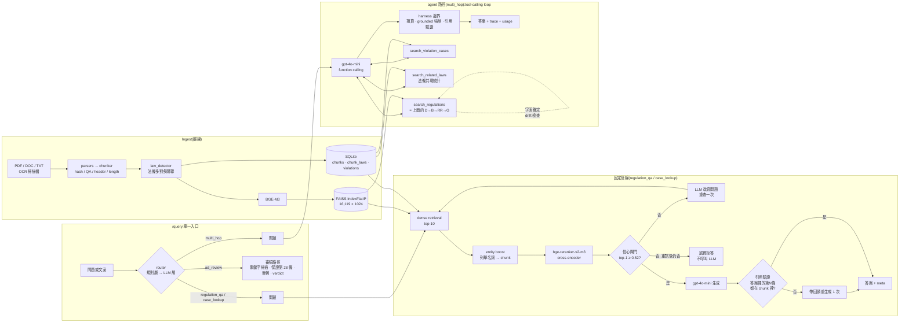

# food-rag:食品法規 RAG 問答系統

[](https://github.com/natalie930302/food-rag/actions/workflows/ci.yml)
[](LICENSE)
[English README](README.en.md) · [研究日誌](docs/RESEARCH_LOG.md) · [評估總表](eval/RESULTS.md) · [技術報告](docs/technical_report.md)

以食藥署法規/指引/問答集(16,119 個 chunks)與台北市違規廣告裁罰公告(400 筆)為語料的
問答 API:**本地 BGE-M3 embedding + FAISS → cross-encoder reranking → 信心閘門 → 雲端 LLM**,
外加一個有邊界的 tool-calling agent(只在 `/query` 判定為多步問題時啟用)。重點不是功能清單,是**每個元件都有量化證據、
每個「提升」都附信賴區間、負向結果照實記錄**。

## 專案地圖

| 目錄 | 是什麼 | 一句話結論 |
|---|---|---|
| `app/` `ingest/` `eval/`(本頁) | **主系統**:法規 RAG 問答 / 廣告審稿 / 有邊界的 agent,單一 `/query` 入口 | reranker 型號才是關鍵;agent 只在多步題目有價值;RAG 在 260 題國考上 +13 點 |
| [`experiments/severity-regression/`](experiments/severity-regression/) | **延伸實驗**:拿同一份 400 筆裁罰案例,從違規文字預測罰款金額 | TF-IDF+Ridge(test R² 0.391)打敗微調 BERT(−0.278)與更小的 rbt3(−0.514):280 筆撐不起 transformer 微調 |

兩者用同一份資料、得到同一類結論:**小資料下,簡單方法加誠實評估,贏過直覺上更強的模型。**

## 30 秒看懂

| 問題 | 答案 | 證據 |
|---|---|---|
| 兩階段檢索(dense → rerank)有用嗎? | **看 reranker**。`bge-reranker-base` 沒有顯著幫助(p=1.00);`bge-reranker-v2-m3` 有(Recall@1 +0.11 [+0.04, +0.19],p=0.008) | [§檢索](#1-檢索兩階段架構不是自動有效) |
| 檢索結果不可信時系統會拒答嗎? | 會。閾值 0.52 下 out-of-domain 20/20 正確拒答,代價是 in-domain 誤拒 8/108 | [§信心閘門](#2-信心閘門乾淨的閾值是小樣本假象) |
| 「讓 LLM 自主決策」比固定重試好嗎? | **單跳沒有**(99 vs 99/108)。為它設計的 20 題 multi-hop 第一次量是輸的(6 vs 10);追出兩個設計不對等、修好後 **13 vs 9**(p=0.22,n 太小不顯著),且有 baseline 做不到的關聯法條查詢 | [§Agent](#3-agent固定重試-vs-tool-calling-harness)、[§Multi-hop](#5-multi-hopagent-什麼時候才真的有用診斷修正再量) |
| harness 的每道邊界各擋掉什麼? | 六道邊界各關一次:只有 drift 檢查有效(關掉 31→28/32);grounded 強制與引用驗證一個都沒攔到,是保險不是提升;§5 新增的兩道在單跳題上量不出差別(它們的效果在 multi-hop) | [§消融](#4-harness-消融每道邊界的存在理由) |
| RAG 真的比閉卷 LLM 好嗎? | **是,在外部題目上第一次量到**:260 題營養師國考,閉卷 66.9% → RAG+fallback 80.0%(+0.13 [+0.09, +0.17],p<0.001);法規類 62.3% → 83.6% | [§國考題](#6-國考題唯一題目與答案都不是我們寫的評估集) |
| 那什麼時候該用 agent? | `/query` 先分流:規則層 100%、整體 97.6%,只把 multi-hop 交給 agent,漏掉案例的有害錯誤 0 題 | [§Router](#7-router單一入口的新失效點量出來) |
| 評估集夠大嗎? | 24 題手寫 → **108 題**(+84 題 LLM 生成、人工審查),外加 8 題 hard、20 題 out-of-domain、20 題 multi-hop、**260 題國考單選題(官方答案)** | [eval/](eval/) |

## 架構



固定管線是確定性的(信心不足就固定做一次改寫重試);agent 路徑把同一套檢索包成工具交給 LLM
決定控制流。三條路徑共用同一層 harness(`app/harness.py`):同一種 trace、usage、拒答契約、引用驗證,
邊界由程式碼強制——**prompt 是請求,程式碼才是保證**。

`/query` 是單一入口:先用零成本的關鍵字規則判意圖,判不出來才問一次 gpt-4o-mini(結構化 JSON、temperature 0),
然後**只把真的需要多步檢索的問題交給 agent**——單跳問題上 agent 跟固定管線一樣準但慢一倍(§3),所以預設走便宜、
確定性的那條(Adaptive-RAG 的精神)。路由決定連同理由回傳在 `route` 欄位。

## 評估結果

全部數字可用 `make eval` 重現,完整表格與每題結果在 [eval/RESULTS.md](eval/RESULTS.md)。
區間是 95% percentile bootstrap CI(10,000 次重抽);配置之間的差距用 paired bootstrap + 精確符號檢定。

### 1. 檢索:兩階段架構不是自動有效

108 題(24 手寫 + 84 合成),候選池固定為 dense top-10,只換排序:

| 配置 | Recall@1 | Recall@3 | MRR |
|---|---|---|---|
| BGE-M3 dense only | 0.722 [0.639, 0.806] | 0.861 [0.796, 0.926] | 0.800 [0.736, 0.862] |
| + bge-reranker-base | 0.731 [0.648, 0.815] | 0.935 [0.889, 0.972] | 0.826 [0.767, 0.883] |
| **+ bge-reranker-v2-m3** | **0.833 [0.759, 0.898]** | 0.907 [0.852, 0.954] | **0.874 [0.818, 0.926]** |

| 比較(Recall@1) | Δ [95% CI] | 翻對 / 翻錯 | 符號檢定 p |
|---|---|---|---|
| dense → +base | +0.009 [−0.065, +0.083] | 9 / 8 | 1.000 |
| +base → +v2-m3 | **+0.102 [+0.037, +0.176]** | 13 / 2 | **0.007** |
| dense → +v2-m3 | **+0.111 [+0.037, +0.185]** | 15 / 3 | **0.008** |

**這推翻了早期的結論。** 24 題時 `bge-reranker-base` 的 Recall@1 從 0.708 到 0.750,當時寫成「全面提升」——
其實只是多對 1 題;108 題上它翻對 9 題、翻錯 8 題,跟沒加一樣。真正有效的是換成更強的 reranker,
而那個決定當初是從一個具體失敗案例(「分類存放」vs「怎麼歸類」的詞義混淆)追出來的,見
[研究日誌](docs/RESEARCH_LOG.md)「reranker 模型升級」一節。手寫題(n=24)與合成題(n=84)分開看趨勢一致,
但手寫題 Recall@1 更高(0.917 vs 0.810)——合成題並沒有比較簡單,反而更難,見 [eval/RESULTS.md](eval/RESULTS.md)。

### 2. 信心閘門:「乾淨的閾值」是小樣本假象

Corrective RAG(Yan et al. 2024)的簡化版:用 reranker top-1 分數當相關性評分,低於閾值就拒答、不呼叫 LLM。
閾值原本是用 24 題 in-domain + 6 題 out-of-domain 校準的:兩組分數有一段乾淨的間隔(gap = +0.93),取中點 0.52。

擴到 108 + 20 題之後,**間隔消失了**(gap = −0.33):

| 閾值 | in-domain 誤拒 | out-of-domain 誤放 |
|---|---|---|
| 0.52(現行) | 8 / 108(7.4%) | 0 / 20 |
| 0.068(總錯誤最少) | 0 / 108 | 2 / 20 |

沒有一個閾值同時零誤拒、零誤放。誤拒的 8 題裡有 4 題是農藥殘留表格、檢驗費用表這類「答案在表格列裡」
的內容,reranker 本來就給不高的分數。現行 0.52 是刻意偏向「寧可拒答也不硬答」,這是產品決策不是統計最佳解,
兩邊的代價都列在上面。

端對端驗證(`eval/eval_corrective.py`,閾值 0.52):in-domain 維持信心且撈到 gold **96/108 = 0.889 [0.824, 0.944]**
(手寫 24/24、合成 72/84);誤拒 8 題;另有 **4 題 confidently wrong**——閘門給高分、卻沒撈到正確答案,這是
confidence-based 方法的結構性盲點,信心閘門偵測不到。out-of-domain **20/20** 正確拒答,包括 4 題刻意設計的近域陷阱
(化妝品標示 0.24、房屋租賃公證 0.40 是最接近閾值的兩題)。

### 3. Agent:固定重試 vs. tool-calling harness

同一組題目、同樣的 hit 定義(gold chunk 有沒有在最後拿去回答的 chunk 裡):

| 問題集 | 固定重試(固定管線) | Tool-calling agent(agent 路徑) | 翻對 / 翻錯 | 符號檢定 p |
|---|---|---|---|---|
| 主評估集(108) | 99/108 = 0.917 [0.861, 0.963] | 99/108 = 0.917 [0.861, 0.963] | 1 / 1 | 1.000 |
| hard(8) | 7/8 = 0.875 [0.625, 1.000] | 7/8 = 0.875 [0.625, 1.000] | 0 / 0 | 1.000 |

- **固定重試在 108 題上確實有用**:8 題觸發改寫重試、3 題救回——先前 8 題 hard set 上「1 題觸發、0 題救回」的負向結論,
  是樣本太小看不到效果
- **agent 在單跳問題上打平,沒有更好**:108 題裡只有 3 題用了 >1 次工具;字面錨定 drift 檢查介入了 25 題(LLM 改寫的查詢
  跟原始問題 top-1 不一致);延遲 20.5 秒/題(reranker 在 GPU;固定管線約 11 秒)。數字為 §5 兩道修正上線後的重跑,單跳沒有退步。早期 32 題上「31/32 超越 30/32」的結論,
  在 108 題上不成立(99 vs 99)
- 兩邊都有 **confidently wrong**(固定重試 6+1 題):閘門給高分、答案卻錯,信心機制偵測不到
- 結論:agent 多出來的自由度(自己決定查詢字串、查幾次)在單跳問題上沒有換到準確率,只換到延遲。它的價值只能在
  需要多步的問題上量(§5)——第一次量沒有贏,追出根因修好後才領先(仍不顯著)。這是 `/query` 只把 multi-hop
  交給 agent、其餘一律走固定管線的依據(§7)

### 4. Harness 消融:每道邊界的存在理由

把 agent 路徑的每道邊界各關掉一次,同一組題目(24 手寫 + 8 hard 量命中率;20 out-of-domain 量「沒依據卻硬答」):

| 配置 | 關掉的東西 | in-domain 命中 | OOD 沒依據卻硬答 | 秒/題 |
|---|---|---|---|---|
| full | — | **31/32 = 0.969 [0.906, 1.000]** | 0/20 | 31.9 |
| no_grounding | 不強制覆寫沒依據的答案 | 30/32 = 0.938 [0.844, 1.000] | **0/20** | 31.8 |
| no_drift_check | 不用字面問題當一致性錨點 | **28/32 = 0.875 [0.750, 0.969]** | 0/20 | 21.6 |
| temp_0.1 | 決策溫度回到 0.1 | 30/32 = 0.938 [0.844, 1.000] | 0/20 | 33.8 |
| no_tool_retry | 工具不內建改寫重試(§5 修正一) | 30/32 = 0.938 [0.844, 1.000] | 0/20 | 23.6 |
| no_force_regulation | 不強制補查法規(§5 修正二) | 30/32 = 0.938 [0.844, 1.000] | 0/20 | 28.2 |

(六組為 §5 修正上線後同一天的重跑,取代先前四組的舊數字 30 / 31 / 27 / 30;秒/題只在同一輪內可比,含 OpenAI API 當時的延遲。)

四個誠實的結論,一個正向、一個「多餘」、一個「一次跑不出來」、一個「這組題量不到」:

- **drift 檢查是真的在擋東西**:關掉後掉 3 題(31 → 28),掉的正是 query drift 那類案例(「超商餐盒牛肉」「食品添加物輸入登記」「外銷登錄」),
  兩輪消融掉的都是同一類題;代價是每題多約 10 秒(再 rerank 一次)
- **grounded 強制覆寫在這組題目上是多餘的**:關掉之後 gpt-4o-mini 對 20 題 OOD 全部自己用不同措辭拒答了(第一版腳本只比對
  拒答句字面,誤計成 19/20 硬答;改用語意判斷後是 0/20)。這條邊界的價值是「保證」而不是「量得到的提升」——prompt 這次守住了,
  不代表下一個模型或下一版 prompt 也會,所以留著,但誠實標示它在本評估集上沒有攔到任何東西
- **temperature=0 的效果一次跑不出來**:0.1 這次也是 30/32。早期發現的「同題重跑結果不一致」是抖動,要多次重跑才量得到,
  單次消融看不出差別,如實記錄

- **§5 新增的兩道邊界在單跳題組上量不出差別**:`no_tool_retry`、`no_force_regulation` 都是 30/32,跟 full 只差 1 題——而且掉的是同一題
  (「食品安全管制窗口要上什麼課」),它在 no_grounding、temp_0.1 也掉,四個互不相關的配置掉同一題,是 LLM 抖動不是邊界的效果。
  這正是預期:單跳題 LLM 平均只呼叫 1.0 次工具、第一次就查對,重試與強制補查根本沒機會觸發。它們的效果在 multi-hop 上(§5:法規命中 8 → 15),
  不在這裡;消融的價值是確認「加了它們,單跳沒有退步」。

**答案層引用驗證也是同一類結果**(`eval/eval_citation_verifier.py`):108 題裡 100 題通過信心閘門並生成答案,88 題答案含條號,
驗證前就 **0/100** 引用了 context 裡沒有的條號——重生成機制一次都沒觸發。prompt 裡的「不得捏造條號」在 gpt-4o-mini 上守住了。
所以六道邊界裡,**只有 drift 檢查在這組評估集上有量得到的效果**;grounded 強制覆寫與引用驗證是程式碼層的保險,
在目前的模型 + prompt 組合下沒有被用到,但換模型或改 prompt 時就是它們在擋。這個結論比「六道邊界都很重要」誠實,
也比較有用:它告訴你 harness 的成本(每題多一次 rerank、多一次驗證)換到的是什麼。

### 5. Multi-hop:agent 什麼時候才真的有用——診斷、修正、再量

單跳題組測不出 agent 的價值(§3),所以另外手寫 20 題需要「法規 + 案例」或「法規 + 關聯法條」的問題
(`eval/multihop_questions.json`)。命中拆成三個元件,全部達成才算 full_hit。

**第一次量(修正前):agent 輸給固定管線 + 關鍵字規則**

| 元件 | baseline(固定管線 + 關鍵字觸發查案例) | tool-calling agent |
|---|---|---|
| reg_hit(法規查對) | 13/20 | 8/20 |
| case_hit(案例查對,17 題要求) | 16/17 | 15/17 |
| related_hit(關聯法條,3 題要求) | 0/3(沒有這個工具) | **3/3** |
| **full_hit** | **10/20** | 6/20 |

翻對 1 / 翻錯 5,p = 0.219。案例那一跳,關鍵字觸發跟 LLM 自己決定去查效果一樣;agent 輸在**法規那一跳**。

**追根因,發現是兩個設計上的不公平,不是 agent 概念的錯:**

1. 固定管線的法規檢索是「查一次 → 信心不夠就 LLM 改寫再查一次」;agent 的 `search_regulations` 工具只有「查一次」,
   改寫重試交給 LLM 自己判斷——它常常不做。工具先天比 baseline 少一次機會
2. system prompt 寫「回答前至少呼叫一次 `search_regulations`」,實測 2/20 題 LLM 直接跳過去查案例就作答,
   被 grounded 邊界正確拒答——規則只寫在 prompt 裡,違反了專案自己的原則「prompt 是請求,程式碼才是保證」

修法各十幾行(`app/agent.py` 邊界 5、6,均可關閉做消融):工具內建同一套改寫重試;LLM 要作答卻從沒查過法規時,
harness 自己用原始問題補查一次再讓它答。第一次跑這組題目還抓到 `search_violation_cases` 拿錯 FAISS 索引的真 bug(案例命中 0/17),
已修並加回歸測試。

**修正後重量(同一組題目):**

| 元件 | baseline | agent(修正前) | **agent(修正後)** |
|---|---|---|---|
| reg_hit | 12/20 = 0.600 [0.400, 0.800] | 8/20 | **15/20 = 0.750 [0.550, 0.900]** |
| case_hit | 16/17 | 15/17 | 15/17 |
| related_hit | 0/3 | 3/3 | **3/3** |
| **full_hit** | 9/20 = 0.450 [0.250, 0.650] | 6/20 | **13/20 = 0.650 [0.450, 0.850]** |

翻對 5 / 翻錯 1,p = 0.219;agent 平均 2.40 次工具呼叫、20/20 題用了 >1 次;延遲 baseline 15.0 秒 / agent 26.2 秒。

**誠實的結論**:方向翻轉了——修掉兩個缺陷後 agent 在為它設計的題組上領先 4 題,而且提升的正是被診斷出的那一跳(法規 8 → 15)。
但 n = 20 的 CI 寬達 ±20 點,p = 0.22,「顯著贏」說不出口;baseline 本身兩次跑也在 9–10 之間抖動(LLM 改寫的非確定性)。
能站得住的說法是:**agent 不再落後,且有 baseline 做不到的關聯法條查詢;代價是 1.7 倍延遲**。要證明顯著,multi-hop 得擴到 50–60 題。

### 6. 國考題:唯一「題目與答案都不是我們寫的」評估集

前面所有題組都有一個共同弱點:題目是我們自己寫的或 LLM 生成的,量的是「有沒有撈到 gold chunk」。
這一組不一樣:**考選部「營養師」國考「食品衛生與安全」109–114 年的 260 題單選題,配官方標準答案**
(`scripts/build_exam_set.py` 從考選部考畢試題平台抓取、解析;試題依《著作權法》第 9 條不受著作權保護)。
量的是**最終答案對不對**。三個系統同一組題,拒答計為答錯;「法規類」是可重現的關鍵字啟發式分組,不做人工篩選:

| 組別 | n | 閉卷 gpt-4o-mini | RAG(信心不足即拒答) | **RAG + 閉卷 fallback** | RAG 作答數 / 作答時正確率 | Δ(fallback − 閉卷)[95% CI] | 翻對 / 翻錯 | p |
|---|---|---|---|---|---|---|---|---|
| 全部 | 260 | 0.669 [0.612, 0.727] | 0.369 [0.312, 0.427] | **0.800 [0.750, 0.846]** | 112 / 0.857 | **+0.131 [+0.088, +0.173]** | 36 / 2 | <0.001 |
| 法規類 | 122 | 0.623 [0.533, 0.705] | 0.582 [0.492, 0.664] | **0.836 [0.770, 0.902]** | 82 / 0.866 | **+0.213 [+0.131, +0.295]** | 28 / 2 | <0.001 |
| 其他(微生物/毒理/加工) | 138 | 0.710 [0.630, 0.783] | 0.181 [0.116, 0.246] | 0.768 [0.696, 0.833] | 30 / 0.833 | +0.058 [+0.022, +0.101] | 8 / 0 | 0.008 |

(隨機猜測 = 0.25;380 次 LLM 呼叫、247k tokens,約 NT$1.5)

這是整個專案裡**唯一一次 RAG 對閉卷 LLM 有顯著、大幅的提升**,而且提升的地方正是它該提升的地方:法規類題目
閉卷 62%,加上檢索 84%(翻對 28 題、翻錯 2 題);非法規類只有 +6%,因為語料裡本來就沒有微生物學。信心閘門的行為也對:
260 題只作答 112 題,作答時 86% 正確;其餘拒答交給閉卷——「有依據才答、沒依據不硬答」在外部題目上成立。
兩個誠實的註腳:法規類仍有 16% 答錯(閉卷與 RAG 都錯的題目,多半是語料沒涵蓋的細節數字);「法規類」的分組是啟發式,
會把少數非法規題算進來,也會漏掉少數法規題,但這比人工挑題可重現。

### 7. Router:單一入口的新失效點,量出來

`/query` 的路由器是新增的失效點,所以單獨評估(`eval/eval_router.py`)。標籤集不用另外標:108+8 題單跳 → `regulation_qa`、
20 題 multi-hop → `multi_hop`,再加 30 題手寫的審稿/案例/邊界題,共 166 題。

| | 題數 | 準確率 |
|---|---|---|
| 規則層(零成本、確定性) | 61(37%) | 61/61 = 1.000 |
| LLM 層(規則判不出來才問) | 105(63%) | 101/105 = 0.962 |
| **整體** | 166 | **162/166 = 0.976 [0.952, 0.994]** |

| gold \ pred | regulation_qa | case_lookup | ad_review | multi_hop | recall |
|---|---|---|---|---|---|
| regulation_qa | 120 | 1 | 1 | 1 | 0.976 |
| case_lookup | 0 | 7 | 0 | 1 | 0.875 |
| ad_review | 0 | 0 | 10 | 0 | 1.000 |
| multi_hop | 0 | 0 | 0 | 25 | 1.000 |

兩種錯的代價不對稱,分開算:**有害**(multi_hop 被判成單跳,會漏掉案例/關聯法條)**0 題**;浪費(單跳被判成 multi_hop,只是變慢)2 題。
第一版規則層只有 90%——把「罰款/裁罰」這類泛用字當成案例訊號,「罰款標準怎麼制定」就被判成案例;收緊成只在訊號很強時才自己判、
其餘交給 LLM 之後,規則層 100%、整體從 94.0% 到 97.6%。這是「規則要窄、LLM 要當 fallback 而不是主力」的一個具體例子。

## 延伸實驗:同一份 400 筆案例的罰款金額迴歸

主系統把 400 筆台北市裁罰案例當檢索語料;[`experiments/severity-regression/`](experiments/severity-regression/) 把同一份資料當監督式學習的標籤,
從違規廣告文字預測罰款金額(log 尺度迴歸,train 280 / val 60 / test 60)。原本規劃「違規/合規」分類,拿到資料才發現裁罰公告只有違規樣本,
於是改成資料本身答得出來的問題,而不是硬造負樣本。

| 方法 | 參數量 | val R² | test R² | test MAE |
|---|---|---|---|---|
| **字元 TF-IDF(2–4gram)+ Ridge** | — | 0.548 | **0.391** | NT$29,642 |
| 微調 bert-base-chinese | ~102M | 0.057 | −0.278 | NT$47,870 |
| 微調 hfl/rbt3(更小 + dropout 0.3 + weight decay + best checkpoint) | ~38M | −0.024 | −0.514 | NT$52,227 |

換更小的模型、加正則化、挑最佳 checkpoint 之後結果更差,連訓練集 R² 都是負的:不是 overfit,是 transformer 微調在這個資料量級下學不到穩定訊號。
這跟主系統「reranker-base 沒幫助、agent 沒有自動變好」是同一種教訓——模型複雜度要跟資料量匹配,而且要量了才知道。
完整實驗紀錄、重現指令與學習筆記見該目錄的 [README](experiments/severity-regression/README.md)。資料由本 repo 的 `make ingest` 產生,不隨 git 提供。

## 誠實的限制

- **合成題目的偏差**:84 題是 gpt-4o-mini 看著 chunk 出的題,雖然過濾了字面重疊(最長共同子字串 ≤ 6 字)、
  人工剔除了 56 題(gold 不唯一、表格切片、OCR 亂碼),仍不等於真實使用者的問法
- **confidently wrong 偵測不到**:信心閘門評的是「內容像不像相關」,不是「答案對不對」;
  答案層引用驗證只能抓「條號不在 context 裡」這種可機械判定的錯,抓不到引用了對的條號但解讀錯
- **案例庫偏斜**:400 筆裁罰案例 391 筆是食安法第 28 條,multi-hop 題組的案例命中對任何真的去查案例的系統都容易
- **法條偵測只認阿拉伯數字**:「第十五條」這類中文條號不會被關聯;`第15條之一` 曾被誤解析成 `第15條`
  (2026/09 修正,索引尚未重建)
- **非確定性**:agent 決策溫度已歸零,但 OpenAI API 本身不保證完全可重現

## 快速開始

```bash
# 系統依賴(Ubuntu/WSL2):tesseract-ocr tesseract-ocr-chi-tra libreoffice poppler-utils
make install && source .venv/bin/activate
cp .env.example .env            # 填 OPENAI_API_KEY
make unzip && make ingest       # 第一次會下載 BGE-M3(~2.3 GB)
make run                        # http://localhost:8000/docs
```

對外只有兩個功能端點——**所有問答、審稿、多步問題都從 `/query` 進**,`/health` 看系統狀態:

```bash
curl -X POST localhost:8000/query -H "Content-Type: application/json" -d '{"question": "真空包裝豆干要符合什麼規定?"}'
curl -X POST localhost:8000/query -H "Content-Type: application/json" -d '{"question": "廣告說能提升免疫力,違反哪條?有案例嗎?"}'
curl -X POST localhost:8000/query -H "Content-Type: application/json" -d '{"question": "本產品有效改善高血壓,三天見效"}'
curl -X POST localhost:8000/query -H "Content-Type: application/json" -d '{"question": "本產品有效改善高血壓", "force_intent": "ad_review"}'
curl localhost:8000/health
```

不管走哪條路徑,回傳都是同一種格式(`app/harness.py`):

| 欄位 | 內容 |
|---|---|
| `route` | 判定的意圖、是規則還是 LLM 判的、理由、實際走的 handler(regulation / review / agent) |
| `trace` | 每一步:`retrieve` / `retry` / `retrieve_cases` / `generate` / `verify_citations` / `refuse`、審稿的 `keyword_scan` / `verdict`、agent 的 `tool:search_regulations`……,各帶耗時、信心分數、chunk id、是否觸發 drift 介入 |
| `usage` | LLM 呼叫次數、工具呼叫次數、prompt / completion token、秒數、停止原因(answered / tool_calls / tokens / seconds) |
| `meta` | `confident`、`used_retry`、`refused`(拒答契約)、`unsupported_citations`(引用驗證)、`grounded`、`hit_tool_call_limit` |
| `verdict` | 只有審稿有:low / medium / high,以 LLM 報告的結論為準、關鍵字規則當保險 |

`/laws/{article}/related` 與 `/files/{path}` 是給前端用的資料端點,不是功能。

```bash
make test     # 84 個單元測試,不需要模型或 API key
make lint
make eval     # 重跑全部評估 → eval/RESULTS.md(需要索引與 API key)
python scripts/replay_trace.py eval/results_tool_agent_drift_check.json --miss   # 逐步回放答錯的題
```

## 專案結構

```
app/                 FastAPI + 檢索/agent 邏輯
  main.py              只有 /query 與 /health 兩個功能端點
  router.py            意圖路由:規則層 → LLM 層
  handlers.py          三條執行路徑(固定管線 / 審稿 / agent),共用同一個 RunContext
  harness.py           統一的 trace、usage、拒答契約、引用驗證
  retrieval.py         SQL 預過濾 + FAISS 搜尋、案例檢索、法條共現
  corrective_retrieval.py  信心閘門(+ entity boost 併入候選)
  agentic_retrieval.py     固定重試(信心不足 → LLM 改寫重查)
  agent.py / agent_tools.py  tool-calling loop:預算、grounded 強制、drift 檢查
  verifier.py          答案層引用驗證(條號必須出現在檢索內容裡)
ingest/              parsers(PDF/DOCX/OCR/表格)→ chunker(4 策略路由)→ law_detector → SQLite + FAISS
eval/                評估集、腳本、stats.py(bootstrap/符號檢定)、RESULTS.md
tests/               單元測試(fake reranker + scripted LLM client)
docs/                研究日誌、技術報告
scripts/             replay_trace、extract_chunk_entities、inspect_index
experiments/
  severity-regression/  延伸實驗:罰款金額迴歸(git subtree 併入,保留原歷史;資料不入庫)
```

## 文件

- [docs/RESEARCH_LOG.md](docs/RESEARCH_LOG.md):依實際執行順序的完整研究紀錄,含每個負向結果與根因診斷(數字為 n=24 時期)
- [docs/technical_report.md](docs/technical_report.md):paper 格式的技術報告
- [eval/RESULTS.md](eval/RESULTS.md):所有評估的完整表格
- 前端:[food-rag-ui](https://github.com/natalie930302/food-rag-ui)(React + Vite)

## License

MIT
