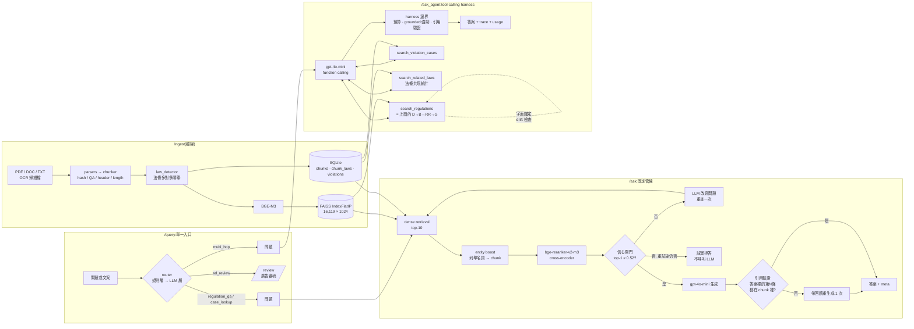

# food-rag:食品法規 RAG 問答系統

[](https://github.com/natalie930302/food-rag/actions/workflows/ci.yml)
[](LICENSE)
[English README](README.en.md) · [研究日誌](docs/RESEARCH_LOG.md) · [評估總表](eval/RESULTS.md) · [技術報告](docs/technical_report.md)

以食藥署法規/指引/問答集(16,119 個 chunks)與台北市違規廣告裁罰公告(400 筆)為語料的
問答 API:**本地 BGE-M3 embedding + FAISS → cross-encoder reranking → 信心閘門 → 雲端 LLM**,
外加一個有邊界的 tool-calling agent(`/ask_agent`)。重點不是功能清單,是**每個元件都有量化證據、
每個「提升」都附信賴區間、負向結果照實記錄**。

## 30 秒看懂

| 問題 | 答案 | 證據 |
|---|---|---|
| 兩階段檢索(dense → rerank)有用嗎? | **看 reranker**。`bge-reranker-base` 沒有顯著幫助(p=0.82);`bge-reranker-v2-m3` 有(Recall@1 +0.12 [+0.05, +0.19],p=0.004) | [§檢索](#1-檢索兩階段架構不是自動有效) |
| 檢索結果不可信時系統會拒答嗎? | 會。閾值 0.52 下 out-of-domain 20/20 正確拒答,代價是 in-domain 誤拒 8/108 | [§信心閘門](#2-信心閘門乾淨的閾值是小樣本假象) |
| 「讓 LLM 自主決策」比固定重試好嗎? | **沒有**。單跳 99 vs 100/108;連為它設計的 20 題 multi-hop 也是 8 vs 10(p=0.69),唯一贏的是 baseline 沒有的關聯法條工具(3/3) | [§Agent](#3-agent固定重試-vs-tool-calling-harness)、[§Multi-hop](#5-multi-hopagent-什麼時候才真的有用) |
| harness 的每道邊界各擋掉什麼? | 消融量出來:只有 drift 檢查有效(關掉 31→27/32);grounded 強制與引用驗證在這組題目上一個都沒攔到,是保險不是提升 | [§消融](#4-harness-消融每道邊界的存在理由) |
| 那什麼時候該用 agent? | `/query` 先分流:規則層 100%、整體 97.6%,只把 multi-hop 交給 agent,漏掉案例的有害錯誤 0 題 | [§Router](#6-router單一入口的新失效點量出來) |
| 評估集夠大嗎? | 24 題手寫 → **108 題**(+84 題 LLM 生成、人工審查),外加 8 題 hard、20 題 out-of-domain、20 題 multi-hop | [eval/](eval/) |

## 架構



`/ask` 是確定性管線(信心不足就固定做一次改寫重試);`/ask_agent` 把同一套檢索包成工具交給 LLM
決定控制流,harness 用程式碼強制邊界——**prompt 是請求,程式碼才是保證**。

`/query` 是單一入口:先用零成本的關鍵字規則判意圖,判不出來才問一次 gpt-4o-mini(結構化 JSON、temperature 0),
然後**只把真的需要多步檢索的問題交給 agent**——單跳問題上 agent 跟固定管線一樣準但慢一倍(§3),所以預設走便宜、
確定性的那條(Adaptive-RAG 的精神)。路由決定連同理由回傳在 `route` 欄位。

## 評估結果

全部數字可用 `make eval` 重現,完整表格與每題結果在 [eval/RESULTS.md](eval/RESULTS.md)。
區間是 95% percentile bootstrap CI(10,000 次重抽);配置之間的差距用 paired bootstrap + 精確符號檢定。

### 1. 檢索:兩階段架構不是自動有效

108 題(24 手寫 + 84 合成),候選池固定為 dense top-10,只換排序:

| 配置 | Recall@1 | Recall@3 | MRR |
|---|---|---|---|
| BGE-M3 dense only | 0.713 [0.630, 0.796] | 0.861 [0.796, 0.926] | 0.796 [0.732, 0.858] |
| + bge-reranker-base | 0.731 [0.648, 0.815] | 0.935 [0.889, 0.972] | 0.826 [0.767, 0.883] |
| **+ bge-reranker-v2-m3** | **0.833 [0.759, 0.898]** | 0.907 [0.852, 0.954] | **0.874 [0.818, 0.926]** |

| 比較(Recall@1) | Δ [95% CI] | 翻對 / 翻錯 | 符號檢定 p |
|---|---|---|---|
| dense → +base | +0.019 [−0.056, +0.093] | 10 / 8 | 0.815 |
| +base → +v2-m3 | **+0.102 [+0.037, +0.176]** | 13 / 2 | **0.007** |
| dense → +v2-m3 | **+0.120 [+0.046, +0.194]** | 16 / 3 | **0.004** |

**這推翻了早期的結論。** 24 題時 `bge-reranker-base` 的 Recall@1 從 0.708 到 0.750,當時寫成「全面提升」——
其實只是多對 1 題;108 題上它翻對 10 題、翻錯 8 題,跟沒加一樣。真正有效的是換成更強的 reranker,
而那個決定當初是從一個具體失敗案例(「分類存放」vs「怎麼歸類」的詞義混淆)追出來的,見
[研究日誌](docs/RESEARCH_LOG.md)「reranker 模型升級」一節。手寫題(n=24)與合成題(n=84)分開看趨勢一致,
但手寫題 Recall@1 更高(0.917 vs 0.810)——合成題並沒有比較簡單,反而更難,見 [eval/RESULTS.md](eval/RESULTS.md)。

### 2. 信心閘門:「乾淨的閾值」是小樣本假象

Corrective RAG(Yan et al. 2024)的簡化版:用 reranker top-1 分數當相關性評分,低於閾值就拒答、不呼叫 LLM。
閾值原本是用 24 題 in-domain + 6 題 out-of-domain 校準的:兩組分數有一段乾淨的間隔(gap = +0.93),取中點 0.52。

擴到 108 + 20 題之後,**間隔消失了**(gap = −0.33):

| 閾值 | in-domain 誤拒 | out-of-domain 誤放 |
|---|---|---|
| 0.52(現行) | 8 / 108(7.4%) | 0 / 20 |
| 0.068(總錯誤最少) | 0 / 108 | 2 / 20 |

沒有一個閾值同時零誤拒、零誤放。誤拒的 8 題裡有 4 題是農藥殘留表格、檢驗費用表這類「答案在表格列裡」
的內容,reranker 本來就給不高的分數。現行 0.52 是刻意偏向「寧可拒答也不硬答」,這是產品決策不是統計最佳解,
兩邊的代價都列在上面。

端對端驗證(`eval/eval_corrective.py`,閾值 0.52):in-domain 維持信心且撈到 gold **96/108 = 0.889 [0.824, 0.944]**
(手寫 24/24、合成 72/84);誤拒 8 題;另有 **4 題 confidently wrong**——閘門給高分、卻沒撈到正確答案,這是
confidence-based 方法的結構性盲點,信心閘門偵測不到。out-of-domain **20/20** 正確拒答,包括 4 題刻意設計的近域陷阱
(化妝品標示 0.24、房屋租賃公證 0.40 是最接近閾值的兩題)。

### 3. Agent:固定重試 vs. tool-calling harness

同一組題目、同樣的 hit 定義(gold chunk 有沒有在最後拿去回答的 chunk 裡):

| 問題集 | 固定重試(`/ask`) | Tool-calling agent(`/ask_agent`) | 翻對 / 翻錯 | 符號檢定 p |
|---|---|---|---|---|
| 主評估集(108) | **100/108 = 0.926 [0.870, 0.972]** | 99/108 = 0.917 [0.861, 0.963] | 0 / 1 | 1.000 |
| hard(8) | 6/8 = 0.750 [0.500, 1.000] | 6/8 = 0.750 [0.500, 1.000] | 0 / 0 | 1.000 |

- **固定重試在 108 題上確實有用**:8 題觸發改寫重試、4 題救回——先前 8 題 hard set 上「1 題觸發、0 題救回」的負向結論,
  是樣本太小看不到效果
- **agent 在單跳問題上打平,沒有更好**:108 題裡只有 3 題用了 >1 次工具;字面錨定 drift 檢查介入了 25 題(LLM 改寫的查詢
  跟原始問題 top-1 不一致);延遲 31.5 秒/題(固定管線先前在同機器量到約 13 秒)。早期 32 題上「31/32 超越 30/32」的結論,
  在 108 題上不成立(99 vs 100,差 1 題)
- 兩邊都有 **confidently wrong**(固定重試 5+2 題):閘門給高分、答案卻錯,信心機制偵測不到
- 結論:agent 多出來的自由度(自己決定查詢字串、查幾次)在單跳問題上沒有換到準確率,只換到延遲。它的價值只能在
  需要多步的問題上量(§5)——量的結果也沒有贏,只有關聯法條這一項是它獨有的。這是 `/query` 只把 multi-hop
  交給 agent、其餘一律走固定管線的依據(§6)

### 4. Harness 消融:每道邊界的存在理由

把 `/ask_agent` 的每道邊界各關掉一次,同一組題目(24 手寫 + 8 hard 量命中率;20 out-of-domain 量「沒依據卻硬答」):

| 配置 | 關掉的東西 | in-domain 命中 | OOD 沒依據卻硬答 | 秒/題 |
|---|---|---|---|---|
| full | — | **31/32 = 0.969 [0.906, 1.000]** | 0/20 | 18.6 |
| no_grounding | 不強制覆寫沒依據的答案 | 30/32 = 0.938 [0.844, 1.000] | **0/20** | 19.3 |
| no_drift_check | 不用字面問題當一致性錨點 | **27/32 = 0.844 [0.719, 0.969]** | 0/20 | 11.4 |
| temp_0.1 | 決策溫度回到 0.1 | 31/32 = 0.969 [0.906, 1.000] | 0/20 | 18.3 |

三個誠實的結論,一個正向、一個「多餘」、一個「一次跑不出來」:

- **drift 檢查是真的在擋東西**:關掉後掉 4 題(31 → 27),掉的正是 query drift 那類案例(「超商餐盒牛肉」「食品添加物輸入登記」);
  代價是每題多 7 秒(再 rerank 一次)
- **grounded 強制覆寫在這組題目上是多餘的**:關掉之後 gpt-4o-mini 對 20 題 OOD 全部自己用不同措辭拒答了(第一版腳本只比對
  拒答句字面,誤計成 19/20 硬答;改用語意判斷後是 0/20)。這條邊界的價值是「保證」而不是「量得到的提升」——prompt 這次守住了,
  不代表下一個模型或下一版 prompt 也會,所以留著,但誠實標示它在本評估集上沒有攔到任何東西
- **temperature=0 的效果一次跑不出來**:0.1 這次也是 31/32。早期發現的「同題重跑結果不一致」是抖動,要多次重跑才量得到,
  單次消融看不出差別,如實記錄

**答案層引用驗證也是同一類結果**(`eval/eval_citation_verifier.py`):108 題裡 100 題通過信心閘門並生成答案,89 題答案含條號,
驗證前就 **0/100** 引用了 context 裡沒有的條號——重生成機制一次都沒觸發。prompt 裡的「不得捏造條號」在 gpt-4o-mini 上守住了。
所以四道邊界裡,**只有 drift 檢查在這組評估集上有量得到的效果**;grounded 強制覆寫與引用驗證是程式碼層的保險,
在目前的模型 + prompt 組合下沒有被用到,但換模型或改 prompt 時就是它們在擋。這個結論比「四道邊界都很重要」誠實,
也比較有用:它告訴你 harness 的成本(每題多一次 rerank、多一次驗證)換到的是什麼。

### 5. Multi-hop:agent 什麼時候才真的有用

單跳題組測不出 agent 的價值(§3),所以另外手寫 20 題需要「法規 + 案例」或「法規 + 關聯法條」的問題
(`eval/multihop_questions.json`)。命中拆成三個元件,全部達成才算 full_hit:

| 元件 | baseline(`/ask` 邏輯:固定重試 + 關鍵字觸發查案例) | tool-calling agent |
|---|---|---|
| reg_hit(法規查對) | **14/20 = 0.700 [0.500, 0.900]** | 10/20 = 0.500 [0.300, 0.700] |
| case_hit(案例查對,17 題要求) | 16/17 = 0.941 [0.824, 1.000] | 15/17 = 0.882 [0.706, 1.000] |
| related_hit(關聯法條,3 題要求) | 0/3(沒有這個工具) | **3/3** |
| **full_hit** | **10/20 = 0.500 [0.300, 0.700]** | 8/20 = 0.400 [0.200, 0.600] |

翻對 2 / 翻錯 4,符號檢定 p = 0.688;agent 平均 2.15 次工具呼叫、18/20 題用了 >1 次(harness 這次真的被用到了)。

**誠實的結論:即使在為 agent 設計的題組上,它也沒有贏過「固定管線 + 關鍵字規則」。** 拆開看才知道為什麼:

- 案例這一跳,`/ask` 的關鍵字觸發(問題含「罰/案例/裁處」就查案例)跟 LLM 自己決定去查,效果一樣(16 vs 15)
- 法規這一跳 agent 反而輸 4 題:多步時 LLM 濃縮的查詢字串更容易飄(§3 的 query drift 在多步場景放大),而且有 2 題它
  直接跳過 `search_regulations` 只查案例,harness 因此判定 ungrounded 而拒答
- agent 唯一無可取代的是 `search_related_laws`(3/3):baseline 沒有這個能力

這個結果第一次跑時是 0/17 案例命中,追下去發現 `search_violation_cases` 拿的是法規 chunk 的 FAISS 索引而不是案例索引
——一個藏了幾個月的真 bug,多步題組才把它逼出來,已修並加回歸測試。

下一步很明確,而且不是「讓 agent 更聰明」:把案例與關聯法條查詢做成**規則觸發的確定性多步管線**,再跟 agent 比一次。
如果打平,agent 在這個領域就只剩「探索未知工具組合」的價值;如果 agent 贏,才是它該存在的證據。

### 6. Router:單一入口的新失效點,量出來

`/query` 的路由器是新增的失效點,所以單獨評估(`eval/eval_router.py`)。標籤集不用另外標:108+8 題單跳 → `regulation_qa`、
20 題 multi-hop → `multi_hop`,再加 30 題手寫的審稿/案例/邊界題,共 166 題。

| | 題數 | 準確率 |
|---|---|---|
| 規則層(零成本、確定性) | 61(37%) | 61/61 = 1.000 |
| LLM 層(規則判不出來才問) | 105(63%) | 101/105 = 0.962 |
| **整體** | 166 | **162/166 = 0.976 [0.952, 0.994]** |

| gold \ pred | regulation_qa | case_lookup | ad_review | multi_hop | recall |
|---|---|---|---|---|---|
| regulation_qa | 120 | 1 | 1 | 1 | 0.976 |
| case_lookup | 0 | 7 | 0 | 1 | 0.875 |
| ad_review | 0 | 0 | 10 | 0 | 1.000 |
| multi_hop | 0 | 0 | 0 | 25 | 1.000 |

兩種錯的代價不對稱,分開算:**有害**(multi_hop 被判成單跳,會漏掉案例/關聯法條)**0 題**;浪費(單跳被判成 multi_hop,只是變慢)2 題。
第一版規則層只有 90%——把「罰款/裁罰」這類泛用字當成案例訊號,「罰款標準怎麼制定」就被判成案例;收緊成只在訊號很強時才自己判、
其餘交給 LLM 之後,規則層 100%、整體從 94.0% 到 97.6%。這是「規則要窄、LLM 要當 fallback 而不是主力」的一個具體例子。

## 誠實的限制

- **合成題目的偏差**:84 題是 gpt-4o-mini 看著 chunk 出的題,雖然過濾了字面重疊(最長共同子字串 ≤ 6 字)、
  人工剔除了 56 題(gold 不唯一、表格切片、OCR 亂碼),仍不等於真實使用者的問法
- **confidently wrong 偵測不到**:信心閘門評的是「內容像不像相關」,不是「答案對不對」;
  答案層引用驗證只能抓「條號不在 context 裡」這種可機械判定的錯,抓不到引用了對的條號但解讀錯
- **案例庫偏斜**:400 筆裁罰案例 391 筆是食安法第 28 條,multi-hop 題組的案例命中對任何真的去查案例的系統都容易
- **法條偵測只認阿拉伯數字**:「第十五條」這類中文條號不會被關聯;`第15條之一` 曾被誤解析成 `第15條`
  (2026/09 修正,索引尚未重建)
- **非確定性**:agent 決策溫度已歸零,但 OpenAI API 本身不保證完全可重現

## 快速開始

```bash
# 系統依賴(Ubuntu/WSL2):tesseract-ocr tesseract-ocr-chi-tra libreoffice poppler-utils
make install && source .venv/bin/activate
cp .env.example .env            # 填 OPENAI_API_KEY
make unzip && make ingest       # 第一次會下載 BGE-M3(~2.3 GB)
make run                        # http://localhost:8000/docs
```

```bash
curl -X POST localhost:8000/ask       -H "Content-Type: application/json" -d '{"question": "真空包裝豆干要符合什麼規定?"}'
curl -X POST localhost:8000/ask_agent -H "Content-Type: application/json" -d '{"question": "廣告說能提升免疫力,違反哪條?有案例嗎?"}'
curl -X POST localhost:8000/review    -H "Content-Type: application/json" -d '{"ad_text": "本產品有效改善高血壓"}'
```

回應的 `meta` 帶 `confident` / `used_retry` / `unsupported_citations`;`/ask_agent` 另外回 `trace`(每步工具、查詢、信心分數、是否觸發 drift 介入)與 `usage`(token / 秒數 / 停止原因)。

```bash
make test     # 84 個單元測試,不需要模型或 API key
make lint
make eval     # 重跑全部評估 → eval/RESULTS.md(需要索引與 API key)
python scripts/replay_trace.py eval/results_tool_agent_drift_check.json --miss   # 逐步回放答錯的題
```

## 專案結構

```
app/                 FastAPI + 檢索/agent 邏輯
  retrieval.py         SQL 預過濾 + FAISS 搜尋、案例檢索、法條共現
  corrective_retrieval.py  信心閘門(+ entity boost 併入候選)
  agentic_retrieval.py     固定重試(信心不足 → LLM 改寫重查)
  agent.py / agent_tools.py  tool-calling harness:預算、grounded 強制、drift 檢查
  verifier.py          答案層引用驗證
ingest/              parsers(PDF/DOCX/OCR/表格)→ chunker(4 策略路由)→ law_detector → SQLite + FAISS
eval/                評估集、腳本、stats.py(bootstrap/符號檢定)、RESULTS.md
tests/               單元測試(fake reranker + scripted LLM client)
docs/                研究日誌、技術報告
scripts/             replay_trace、extract_chunk_entities、inspect_index
```

## 文件

- [docs/RESEARCH_LOG.md](docs/RESEARCH_LOG.md):依實際執行順序的完整研究紀錄,含每個負向結果與根因診斷(數字為 n=24 時期)
- [docs/technical_report.md](docs/technical_report.md):paper 格式的技術報告
- [eval/RESULTS.md](eval/RESULTS.md):所有評估的完整表格
- 前端:[food-rag-ui](https://github.com/natalie930302/food-rag-ui)(React + Vite)

## License

MIT
